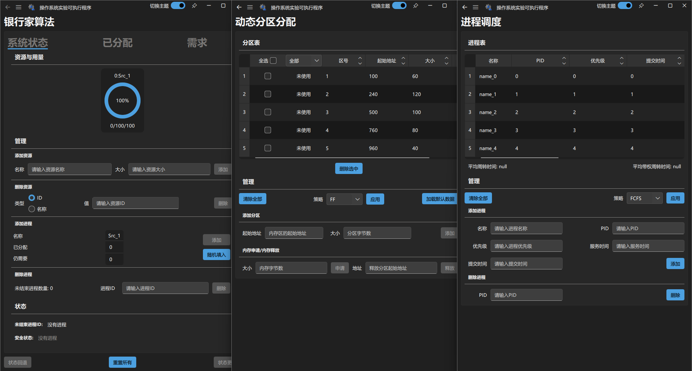
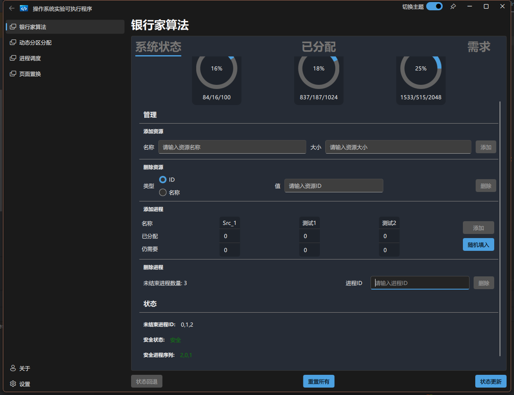
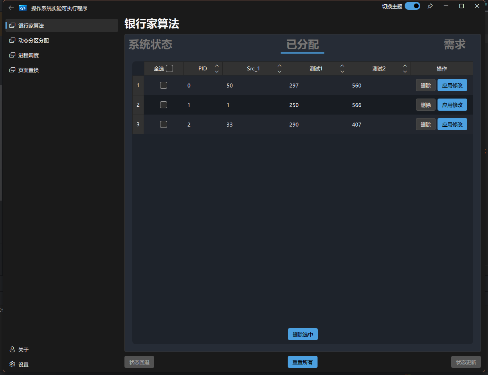
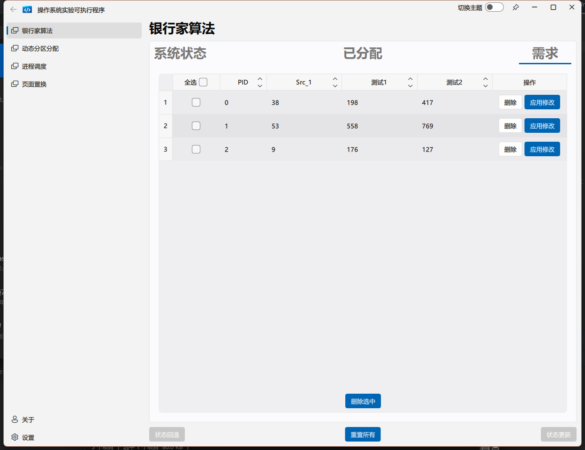

[for English users](./README_en_US.md)

# 这是什么？

一个我用于学习的项目，顺便完成操作系统实验课程的作业。目前核心功能只会跟那堆实验有关。（实在是太菜了，开始写了才知道，想起来很简单的功能，写起来有多麻烦(恼。）包括了经典的银行家算法，一些简单的动态分区(TO DO)、页面交换(TO DO)、进程调度(TO DO)以及老师还没布置的实验些...

- 项目使用Qt框架和[FluentUI](https://github.com/zhuzichu520/FluentUI)第三方库。

- 支持Windows平台 ~~(将会支持 Linux 和 Mac)~~（等我慢慢写完（确信））

- 没有实际有用的功能。（PS：希望有朝一日能有能力做出实际有用的东西吧）

- To be continued

# 进度

- [x] 银行家算法（100%）

- [x] 动态分区（100%）

- [x] 页面交换（100%）

- [x] 进程调度（100%）

- [x] 磁盘调度（100%）

- [ ] ~~设置页面（0%）~~

- [ ] ~~END~~

大概，也就?%罢...

:(

# 截图

# 构建

使用 msvc 和 **Qt 5.15.2** （以及Cmake）构建, Qt 6 暂时不支持（等我写完了再来调Cmake）。

# 写在最后

大三废物，初来乍到，请多包涵~