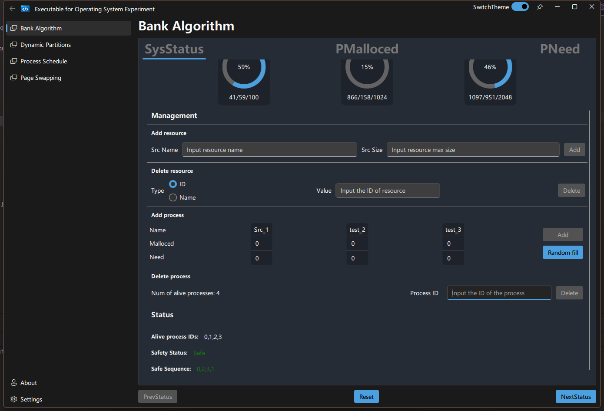
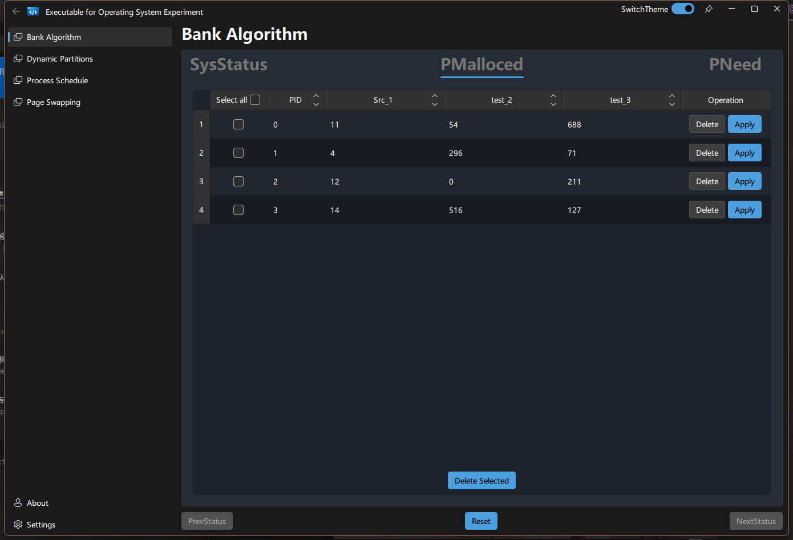
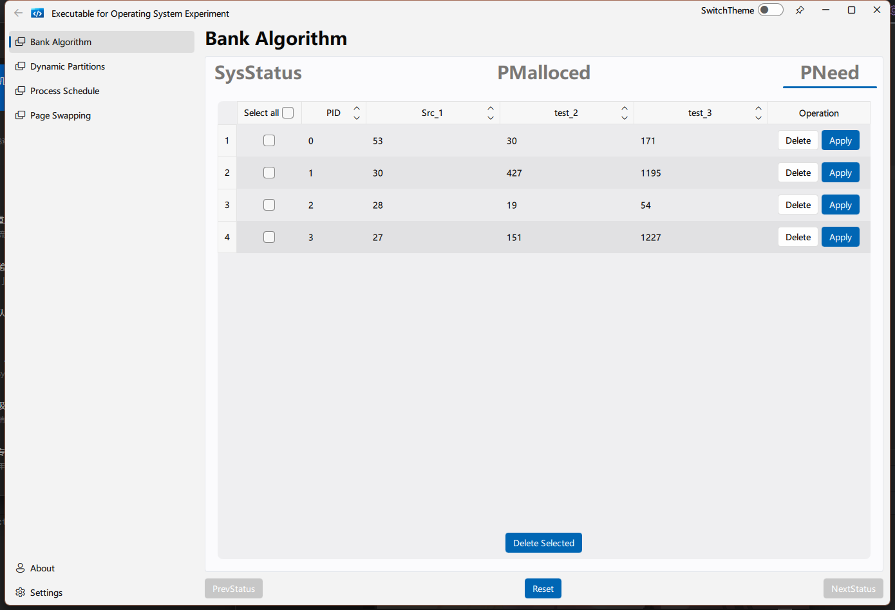

[for Chinese user](./README.md)

# What's this?
A learning project for my self-study. Meanwhile, finish the homework that my teacher left. Currently, the core function of this application will be the same with the homework's content. Including the classical deadlock algorithm "bank algorithm" (almost finished),some sample dynamic partition algorithm (to do), page-swapping algorithm (to do) and process schedule algorithm (to do).

- This object uses the Qt library with the [FluentUI](https://github.com/zhuzichu520/FluentUI) 3rd-party library.

- Support Windows platform ~~(Linux and Mac in the future)~~

- Nothing useful

- To be continued

# Procedure

-[x] Bank Algorithm
-[ ] Dynamic Partition
-[ ] Page Swapping
-[ ] Process Schedule
-[ ] Settings Page
-[ ] ......

About 10% finished...

:(

# Screenshots

# Build

build with msvc and **Qt 5.15.2**, Qt 6 not supported currently.